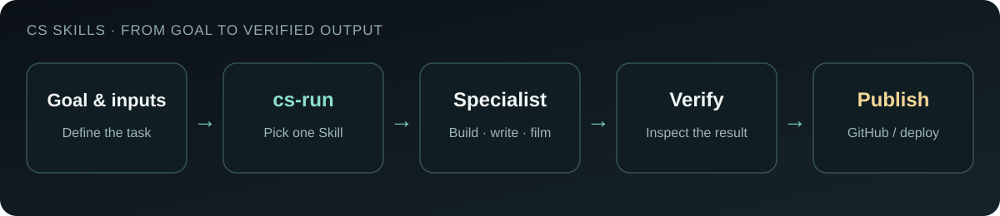
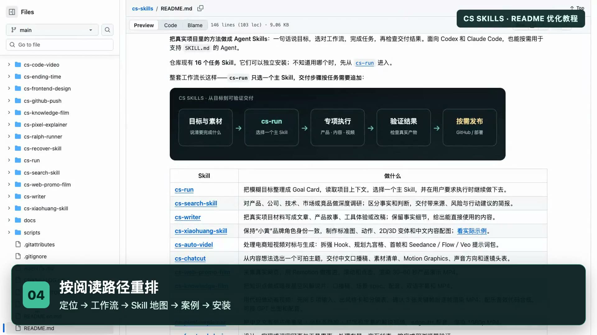
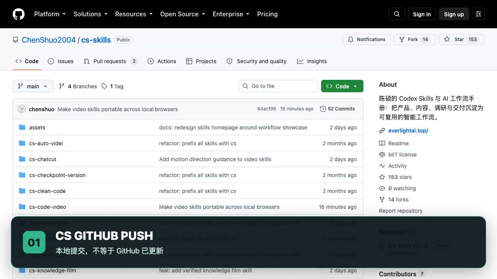

[](README.md)
[](README.en.md)
[](https://x.com/ChenshuoAI)

# CS Skills

**Repeatable methods from real projects, packaged as installable Agent workflows you can run and verify.** Built for Codex and Claude Code; other agents that support `SKILL.md` can use individual Skills too.


The repository contains **16 task Skills**. Know your goal but not the right Skill? Start with [`cs-run`](cs-run/). It clarifies the task and selects one primary workflow. Every Skill can also be installed separately.

[Get started](#get-started) · [Choose by goal](#choose-by-goal) · [Real demos](#real-demos) · [Install and maintain](#install-and-maintain)

## Get started

```bash
git clone https://github.com/ChenShuo2004/cs-skills.git
cd cs-skills
./scripts/install.sh --codex   # Use --claude for Claude Code; --both for both
```

Start a new agent session and state the goal:

```text
$cs-run Turn these project notes into an article with concrete details and steps readers can repeat.
```

If you know the workflow, call it directly. For a fact-checked knowledge video:

```text
$cs-code-video Use Vibe knowledge mode to explain "Why is the sky blue?" Verify sources, make three visual samples and a 10-second opening sample, then render the full video.
```

This process lives in the [Vibe mode of `cs-code-video`](cs-code-video/references/vibe-knowledge.md); there is no separate knowledge-video Skill to install.

## Choose by goal



`cs-run` selects one primary Skill. Add a delivery step only when the task needs a commit, push, or deployment.

| Goal | Skill | Main output |
| --- | --- | --- |
| Unsure where to start | [`cs-run`](cs-run/) | Goal Card, primary Skill, and executed result |
| Write an article, outline, or project story | [`cs-writer`](cs-writer/) | Grounded draft or revision |
| Research a product, technology, market, or competitor | [`cs-search-skill`](cs-search-skill/) | Sourced decision brief |
| Extend Xiaohuang or illustrate an article | [`cs-xiaohuang-skill`](cs-xiaohuang-skill/) | Character assets, shot list, and illustrations |
| Plan a ChatCut video | [`cs-chatcut`](cs-chatcut/) | Topic, voiceover, assets, and shot-by-shot plan |
| Analyze ecommerce videos and prepare generation assets | [`cs-auto-videl`](cs-auto-videl/) | Hook, nine-grid plan, first frames, and model prompts |
| Film a real web page as a product demo | [`cs-web-promo-film`](cs-web-promo-film/) | Remotion project and MP4 |
| Make code animation or a Vibe knowledge video | [`cs-code-video`](cs-code-video/) | Storyboard, sample, rerenderable project, and MP4; Vibe mode adds sources |
| Make a fixed night-sky explainer series | [`cs-knowledge-film`](cs-knowledge-film/) | Scene spec, narration, bilingual subtitles, and MP4 |
| Make a fixed pixel-art explainer series | [`cs-pixel-explainer`](cs-pixel-explainer/) | Pixel animation, narration, SRT, and MP4 |
| Design or build a product interface | [`cs-frontend-design`](cs-frontend-design/) | Usable UI and browser checks |
| Clean up code and reconcile docs with behavior | [`cs-clean-code`](cs-clean-code/) | Scoped changes and verification record |
| Turn Markdown requirements into a Ralph workflow | [`cs-ralph-runner`](cs-ralph-runner/) | Ralph PRD and safe rehearsal |
| Save a rollback point before a large change | [`cs-checkpoint-version`](cs-checkpoint-version/) | Restorable local checkpoint |
| Commit, push, or open a PR | [`cs-github-push`](cs-github-push/) | Scoped commit and remote SHA verification |
| Finish a web or app deployment | [`cs-ending-time`](cs-ending-time/) | Verification, GitHub delivery, and live checks |

Choose video Skills by **source material and production method**: real web pages use `cs-web-promo-film`; ecommerce references and generation packages use `cs-auto-videl`; ChatCut planning uses `cs-chatcut`; code-generated frames use `cs-code-video`. Night-sky and pixel explainers are separate fixed series. See the [Skill inventory](docs/skill-inventory.md) for boundaries. `cs-recover-skill` is an execution calibration helper, not one of the 16 task Skills, and is excluded from the default install.

## Real demos

### Improve a README

[This original homepage redesign](https://github.com/ChenShuo2004/cs-skills/commit/0b27495ba82a9297eb4028ee443edb69b7a0ef31) shows how to inspect `AGENTS.md`, the Skill directories, and the installer before organizing the Chinese and English entry points and checking links.

<a href="assets/demos/readme-optimization/demo-v2.mp4"></a>

[Watch the 73-second tutorial](assets/demos/readme-optimization/demo-v2.mp4) · [Narration, shot list, and reproduction notes](assets/demos/readme-optimization/VO.md)

### Push to GitHub

[`cs-github-push`](cs-github-push/) checks scope, commits precisely, and compares the remote SHA. A local commit, a remote push, and a live deployment are distinct states.

<a href="assets/demos/cs-github-push-demo.mp4"></a>

[Watch the 45-second recording](assets/demos/cs-github-push-demo.mp4) · [Narration and shot list](assets/demos/cs-github-push-script.md)

For visual examples, see the [Xiaohuang Skill showcase](cs-xiaohuang-skill/README.md).

## Install and maintain

With no names, the script installs all 16 task Skills. You can select individual Skills instead:

```bash
./scripts/install.sh --claude cs-run cs-code-video  # Claude Code only
./scripts/install.sh --both cs-run                    # Codex and Claude Code
./scripts/install.sh --codex --dry-run                # Preview without changes
./scripts/install.sh --codex --uninstall cs-run       # Remove this repository's link
```

The script never overwrites existing directories or links from elsewhere. Keep the clone at the same path; after `git pull`, start a new agent session to read updates. Installing `cs-run` alone does not install specialist Skills. The destination directories are `$HOME/.codex/skills` and `$HOME/.claude/skills`. Run `./scripts/install.sh --help` for all options.

You need an agent to use the Skills and Git plus Bash to clone and install them. Video, image, and deployment Skills list their additional requirements in their own `SKILL.md`. Pushing to GitHub requires write access to the target repository.

Each Skill starts at `SKILL.md`. Codex display metadata lives in `agents/openai.yaml`; detailed rules and tools live in `references/`, `scripts/`, and `assets/` as needed. When changing a task Skill, keep [`cs-run` routing](cs-run/SKILL.md), the [Skill inventory](docs/skill-inventory.md), and both READMEs in sync. See [AGENTS.md](AGENTS.md) for maintainer rules. Run `./scripts/test-install.sh` to test the installer in a temporary directory.

[MIT License](LICENSE) · [Changelog](CHANGELOG.md) · [Contributors](CONTRIBUTORS.md) · [Star history](https://star-history.com/#ChenShuo2004/cs-skills&Date)
