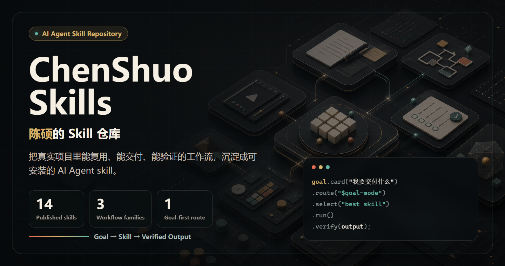

# ChenShuo Skills



ChenShuo Skills 是我在真实项目里沉淀的一组 AI Agent 工作流。它不是提示词收藏夹，而是一个可以按目标安装、调用、验证和持续维护的 skill 库。

当前仓库已发布 **14 个 skill**，覆盖自动剪辑、内容写作、信息图生产、前端设计、PRD 执行、代码质量、交付收尾和目标路由。

## 先按目标选 skill

不要先问“我该用哪个提示词”，先把目标说清楚：

```text
我现在想达成什么结果？
输入是什么？
输出应该长什么样？
怎么验证它真的完成了？
```

如果目标还不清楚，先装 `$goal-mode`。它会把目标、输入、输出、约束和验证方式整理成任务卡，再推荐下一步应该用哪个 skill。

## 代码动画


这张动画图用代码生成，文字不会漂移：`ChenShuo Skills`、`陈硕的 Skill 仓库`、`Goal → Skill → Verified Output` 都是仓库首页要突出的核心信息。

## Skill 曲线图


这张曲线按仓库提交历史和当前目录盘点生成：

- 2026-05-25：首批发布 12 个核心 skill。
- 2026-05-25：新增 `$goal-mode`，把“先说目标，再选 skill”变成入口。
- 2026-05-26：新增 `$ending-time`，补上验证、提交、GitHub 和 Vercel 交付收尾。
- 2026-06-04：当前盘点为 14 个已发布 skill。

## 功能全景

| Skill | 功能定位 | 适合输入 | 输出与验证 |
| --- | --- | --- | --- |
| `$goal-mode` | 目标澄清和 skill 路由入口 | 模糊目标、任务想法、当前素材和约束 | Goal Card、推荐 skill、下一步可发送 prompt |
| `$auto-cutting` | 自动剪辑主工作流 | 视频需求、素材目录、剪辑方向、字幕/BGM/转场要求 | 剪辑计划、时间线、渲染与验证路径 |
| `$auto-cutting-prd` | 把自动剪辑想法写成可执行需求 | 视频创意、口播方向、素材说明、发布目标 | Markdown 需求、剪辑方案、Ralph PRD 草案 |
| `$auto-render-video` | 直接剪辑、拼接、混音、渲染 MP4 | 素材、脚本、字幕、render-plan 或成片要求 | MP4 成片、渲染记录、可复查验证结果 |
| `$auto-cutting-ralph` | 自动剪辑工程闭环 | 自动剪辑需求、目标 repo、dry-run 约束 | Ralph PRD、dry-run 输出、问题反馈 |
| `$happy-writer` | 陈硕风格长文、改稿和内容提纲 | 项目记录、工具体验、素材片段、观点草稿 | 文章、标题角度、提纲、改写稿 |
| `$li-info` | 理想车主信息图快捷入口 | 账号链接、场景、分享码、IP/Prompt Code | 信息图文案、imagegen 提示词、质检记录 |
| `$li-auto-infographic-suite` | 理想车主信息图批量生产 | 多账号、多主题、素材池、发布/归档要求 | 批量套图、QA、归档、发布信息 |
| `$li-auto-minimal-infographic` | 极简分享码信息图 | 分享码、目标人群、CTA、禁用内容、轻 IP 要求 | 极简页面方案、提示词、交付清单 |
| `$frontend-design` | 前端页面、工具、仪表盘设计与评审 | 页面需求、截图、现有 UI、交互问题 | UI 方案、实现约束、浏览器验证清单 |
| `$open-design` | 使用本地 Open Design 生成设计产物 | 原型/看板/移动端/幻灯片/设计系统需求 | Open Design 产物路径、执行步骤、设计输出 |
| `$ralph-runner` | Markdown 需求转 Ralph PRD 并 dry-run | Markdown PRD、目标 repo、本地运行约束 | PRD JSON、overview、dry-run 日志 |
| `$clean-code` | 代码清理、文档同步和交付质量检查 | 已实现代码、需求文档、review/收尾要求 | 修复建议、代码整理、验证命令和结果 |
| `$ending-time` | 最后一公里交付收尾 | 已完成页面/功能、提交/推送/部署目标 | 验证报告、GitHub 推送/PR、Vercel 部署链接 |

每个 skill 都尽量回答同一组问题，保证未来使用时不会只停留在“提示词看起来不错”：

1. 用户目标是什么？
2. 输入是什么？
3. 输出是什么？
4. 核心流程是什么？
5. 边界情况有哪些？
6. 怎么验证完成？

## 快速安装

在支持安装 GitHub skill 的 AI 编程工具里使用：

```text
帮我安装这个 skill：https://github.com/ChenShuo2004/chenshuo-skills/tree/main/<skill-name>
```

示例：

```text
帮我安装这个 skill：https://github.com/ChenShuo2004/chenshuo-skills/tree/main/goal-mode
```

```text
帮我安装这个 skill：https://github.com/ChenShuo2004/chenshuo-skills/tree/main/happy-writer
```

```text
帮我安装这个 skill：https://github.com/ChenShuo2004/chenshuo-skills/tree/main/ending-time
```

## 按场景选择

| 目标 | 推荐入口 | 典型结果 |
| --- | --- | --- |
| 不知道该用哪个 skill | `$goal-mode` | 任务卡、推荐 skill、下一步 prompt |
| 把自动剪辑想法变成方案 | `$auto-cutting-prd` | 需求文档、剪辑计划、PRD 草案 |
| 直接生成视频 | `$auto-render-video` | MP4 成片、渲染记录、验证结果 |
| 跑完整自动剪辑工程 | `$auto-cutting-ralph` | Ralph PRD、dry-run 结果、日志路径 |
| 做理想车主信息图 | `$li-info` | 文案、提示词、质检记录 |
| 做批量信息图生产 | `$li-auto-infographic-suite` | 批量套图、归档、发布信息 |
| 写文章或改稿 | `$happy-writer` | 文章、提纲、改写稿 |
| 做前端体验设计或评审 | `$frontend-design` | UI 方案、实现约束、验证清单 |
| 从 Markdown 跑 Ralph | `$ralph-runner` | PRD JSON、overview、dry-run 输出 |
| 清理代码和文档 | `$clean-code` | 修复建议、文档同步、验证结果 |
| 收尾提交和部署 | `$ending-time` | GitHub/Vercel 交付闭环 |

## 仓库结构

```text
chenshuo-skills/
  README.md
  LICENSE
  assets/
    chenshuo-skills-cover.png
    chenshuo-skills-hero.png
    skill-code-animation.svg
    skill-growth-curve.svg
  docs/
    goal-mode.md
    repository-plan.md
    skill-inventory.md
  auto-cutting/
  auto-cutting-prd/
  auto-cutting-ralph/
  auto-render-video/
  clean-code/
  ending-time/
  frontend-design/
  goal-mode/
  happy-writer/
  li-auto-infographic-suite/
  li-auto-minimal-infographic/
  li-info/
  open-design/
  ralph-runner/
```

每个 skill 尽量保持自包含：

- `SKILL.md`：核心触发说明和工作流。
- `agents/openai.yaml`：UI 展示文案和默认 prompt。
- `references/`：需要时再读取的详细规则。
- `assets/`：模板或生成所需资源。
- `scripts/`：可重复执行的确定性脚本。

## 维护原则

1. 只保留真实项目里有用的工作流。
2. 每个 skill 必须有明确 goal、输入、输出和验证方式。
3. `SKILL.md` 保持短而可触发，复杂规则放到 `references/`。
4. 不写死个人本机路径、账号信息、私有资料或不可公开链接。
5. 新增 skill 前先问：它解决的是一个稳定目标，还是一次性提示词？

## 发布信息

仓库地址：[ChenShuo2004/chenshuo-skills](https://github.com/ChenShuo2004/chenshuo-skills)

当前已完成：

1. 发布 14 个核心/入口/基础设施 skill。
2. 添加带陈硕署名的 GitHub 首页视觉、代码动画和 skill 增长曲线图。
3. 补齐 `LICENSE` 和 `.gitignore`。
4. 校验所有 `SKILL.md` frontmatter。
5. 清理本机绝对路径和敏感信息。
