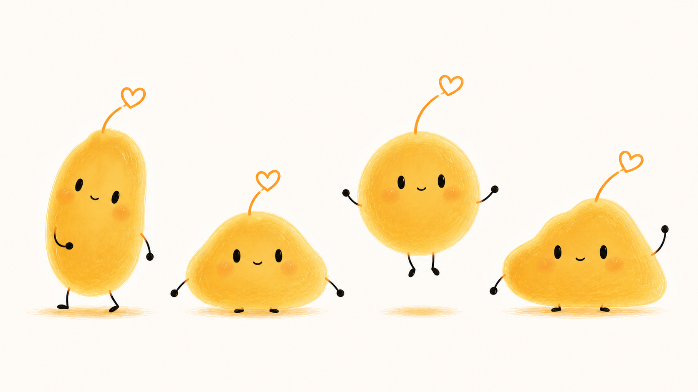

# CS Skills


[更新日志](CHANGELOG.md) · [贡献者说明](CONTRIBUTORS.md)

> 一句话说目标，让 Codex 自动选择工作流，把事情推进到可验证的结果。

CS Skills 是陈硕在真实项目中沉淀的一组 Codex AI Agent 工作流。

它不是 Prompt 收藏夹，也不是一堆互相抢触发的 skill，而是一套精简的任务系统：

```text
用户目标 → $cs-run → 对应 skill → 验证结果
```

当前包含 11 个 active skill，覆盖产品设计、工程开发、内容创作、深度调研、品牌 IP 视觉、电商视频和交付收尾。

## 适合谁

- 用 Codex 做真实产品和 SaaS 的独立开发者。
- 想把个人工作方法沉淀成可复用 AI 工作流的人。
- 需要同时处理产品、代码、内容、调研和交付的 AI 创业者。
- 不想每次都先研究“应该调用哪个 Prompt / skill”的用户。

## 30 秒开始

### 1. 安装主入口

```text
帮我安装这个 skill：https://github.com/ChenShuo2004/cs-skills/tree/main/cs-run
```

`$cs-run` 是任务入口。它负责理解目标、整理输入和输出、识别约束、选择下游 skill，并在你要求执行时继续推进。

> 注意：`cs-run` 负责路由，不会自动下载尚未安装的下游 skill。建议把你常用的下游 skill 一起安装。

### 跨 Agent 使用与归属

这是陈硕维护的 `CS Skills`。每个 skill 的核心入口都是标准 `SKILL.md`，因此只要其他 Agent 支持读取 `SKILL.md`，就可以直接复用同一套触发条件、输入输出、边界和验证规则；Codex 额外读取 `agents/openai.yaml` 来显示名称、功能描述和默认 Prompt。

为了避免与其他 skill 混淆，Codex 主入口显示为 `cs-skills`，下游 skill 保留具体功能名，右侧功能描述统一标注“陈硕的……”。每个 `SKILL.md` 的元数据也包含作者、源码地址和兼容性说明。推荐把整个仓库作为一个 skill 集合安装，而不是只安装 `$cs-run`。

### 2. 直接说结果

```text
$cs-run 我想把这个想法做成一个可以上线的产品，帮我拆解并开始执行。
```

### 3. 有很多内容想法时，先收敛成一条值得拍的视频

```text
$youwendu-skill 我有一批关于 AI 创业的内容想法。请先合并重复项，按受众相关性、观点张力、事实支撑和制作可行性排序，推荐最值得先拍的一条；我确认后再写口播稿和制作蓝图。
```

它不会直接开剪。它先帮你从想法里挑出一个有明确对象和证据的内容切口，确认口播稿后才生成素材、Motion Graphics、声音和逐镜头表。

### 4. 也可以直接调用具体能力

```text
$cs-writer 把这份项目记录写成一篇有观点、有细节的文章。
$search-skill 调研这个产品和主要竞品，给我一份有来源的决策简报。
$frontend-design 设计并实现这个页面，最后做浏览器验证。
$clean-code 检查这次实现，整理代码、文档和测试。
$you-wendu-ip 基于角色参考图生成一张保持身份一致的有温度 IP 插画。
$ending-time 这个功能已经完成，帮我验证、提交、推送和部署。
```

## 它解决什么问题

| 传统问题 | CS Skills 的做法 |
| --- | --- |
| 不知道该从哪个 skill 开始 | 统一进入 `$cs-run`，由目标驱动路由 |
| AI 只给建议，不负责推进 | 每个 skill 都定义输入、输出、流程和验证 |
| 每次都要重复解释自己的工作方法 | 把真实项目经验沉淀成可复用工作流 |
| skill 越装越多，触发互相冲突 | 只保留稳定目标，明确入口和边界 |
| 完成后不知道是否真的交付 | 通过 `$clean-code` 和 `$ending-time` 做质量与发布收尾 |

## Active Skills

### 主入口

| Skill | 功能 | 典型输出 |
| --- | --- | --- |
| [$cs-run](https://github.com/ChenShuo2004/cs-skills/tree/main/cs-run) | 目标澄清、任务卡和自动路由 | Goal Card、推荐路径、执行结果 |

### 产品与工程

| Skill | 功能 | 典型输出 |
| --- | --- | --- |
| [$frontend-design](https://github.com/ChenShuo2004/cs-skills/tree/main/frontend-design) | 前端页面、工具、仪表盘设计与评审 | UI 方案、实现约束、浏览器验证 |
| [$clean-code](https://github.com/ChenShuo2004/cs-skills/tree/main/clean-code) | 代码清理、重构、文档同步和质量检查 | 有边界的修改、测试和交付说明 |
| [$ralph-runner](https://github.com/ChenShuo2004/cs-skills/tree/main/ralph-runner) | Markdown PRD 转 Ralph 执行 | Ralph PRD、overview、dry-run 日志 |
| [$checkpoint-version](https://github.com/ChenShuo2004/cs-skills/tree/main/checkpoint-version) | 大改前保存版本和回退 | 可恢复的本地 checkpoint |
| [$ending-time](https://github.com/ChenShuo2004/cs-skills/tree/main/ending-time) | 验证、提交、推送、PR 和部署收尾 | 交付报告、GitHub/Vercel 结果 |

### 内容、调研、视觉与视频

| Skill | 功能 | 典型输出 |
| --- | --- | --- |
| [$cs-writer](https://github.com/ChenShuo2004/cs-skills/tree/main/cs-writer) | 文章、改稿、项目复盘和内容提纲 | 角度、提纲、文章或审稿意见 |
| [$search-skill](https://github.com/ChenShuo2004/cs-skills/tree/main/search-skill) | 产品、公司、技术、市场和竞品深度调研 | 来源、对比、风险和决策建议 |
| [$you-wendu-ip](https://github.com/ChenShuo2004/cs-skills/tree/main/you-wendu-ip) | 有温度 IP 标准图、动作延展、2D/3D、联名与风格迁移 | 身份锁定的角色图、变体和 QA 结果 |
| [$auto-videl](https://github.com/ChenShuo2004/cs-skills/tree/main/auto-videl) | 电商短视频复刻、分镜和生成包 | 分镜图、首帧图、Seedance/Flow/Veo 提示词 |
| [$youwendu-skill](https://github.com/ChenShuo2004/cs-skills/tree/main/youwendu-skill) | 把内容想法收敛为 ChatCut 视频蓝图 | 选题排序、口播稿、素材清单、Motion Graphics 和逐镜头表 |

## 有温度 IP Skill


`$you-wendu-ip` 用于稳定生成、修改和延展“有温度”品牌角色。它把角色身份拆成明确的轮廓、爱心天线、面部、四肢、颜色和品牌动作规则，让角色可以换动作、换场景、换媒介，但不会变成另一个普通萌物。

安装：

```text
帮我安装这个 skill：https://github.com/ChenShuo2004/cs-skills/tree/main/you-wendu-ip
```

典型调用：

```text
使用 $you-wendu-ip 基于角色参考图生成一张递出连接爱心的 2D 手绘插画。
使用 $you-wendu-ip 把这个角色转换成哑光软胶 3D 版本，只改变体积和材质。
使用 $you-wendu-ip 生成 4 个轮廓结构不同、但角色 DNA 一致的形态方向。
```

### 示例产出

#### 2D 标准形象


#### 点亮一个物体


#### 3D 哑光软胶


#### 四种结构方向



## 真实使用场景

### 从想法到产品

```text
$cs-run 我想做一个帮助独立开发者管理 AI 工作流的 SaaS。
```

先由 `$cs-run` 整理目标，再根据任务进入 `$frontend-design`、`$clean-code`、`$ralph-runner` 或 `$ending-time`。

### 从项目记录到文章

```text
$cs-writer 把这次产品开发过程写成一篇适合公众号发布的文章。
```

它会提炼真实场景、选择文章角度、补齐结构，并避免编造经历、数据和结果。

### 从很多想法到一条可拍视频

```text
$youwendu-skill 我记录了 12 个关于独立开发和 AI 工作流的想法。请先筛选最适合抖音的 3 个，说明选择理由；我确认一个后，再完成 60 秒口播稿和 ChatCut 制作蓝图。
```

它先让内容方向变得可判断：观众是谁、为什么会停留、靠什么事实支撑、要用什么素材讲清。主题确认后才进入脚本与制作筹备，避免一开始就把多个观点塞进一条视频。

### 从竞品到决策

```text
$search-skill 调研这个方向的主要竞品，给出带来源的进入建议。
```

它会建立研究地图、搜索当前来源、对比竞品，并区分事实、推断、风险和行动建议。

### 从产品图到电商视频

```text
$auto-videl 我有一个对标视频和产品图，帮我生成九宫格分镜和 Google Flow 提示词。
```

它适合电商短视频创意和生成包，不等同于通用时间线剪辑或 MP4 渲染。

### 从参考图到稳定角色延展

```text
$you-wendu-ip 保持这个角色的爱心天线、面部比例和细四肢，生成一个坐着思考的 2D 版本。
```

它会先锁定角色 DNA，再区分角色延展、媒介转换、风格迁移或联名共创，生成后按身份清单检查漂移。

## 设计原则

每个 skill 都应该清楚回答：

1. 目标是什么？
2. 输入是什么？
3. 输出是什么？
4. 核心流程是什么？
5. 边界在哪里？
6. 怎么验证完成？

新增 skill 前先确认它解决的是稳定目标，而不是一次性 Prompt；如果可以并入已有 skill，就不新增入口。

## 当前边界

以下方向已经从 active library 中移除：

- 自动剪辑、时间线编排和通用 MP4 渲染。
- 理想车主信息图生产。
- Open Design 设计产物。

退休目录保存在工作区外的归档中，不参与 skill 发现。

## 仓库结构

```text
cs-skills/
├── README.md
├── LICENSE
├── assets/
├── docs/
├── cs-run/
├── cs-writer/
├── search-skill/
├── you-wendu-ip/
├── auto-videl/
├── youwendu-skill/
├── frontend-design/
├── clean-code/
├── ralph-runner/
├── checkpoint-version/
└── ending-time/
```

每个 skill 尽量保持自包含：

- `SKILL.md`：触发说明和核心工作流。
- `agents/openai.yaml`：UI 展示文案和默认 Prompt。
- `references/`：需要时再读取的详细规则。
- `scripts/`：可重复执行的确定性脚本。
- `tests/`：关键脚本或契约的回归测试。

## License

[MIT](LICENSE)


