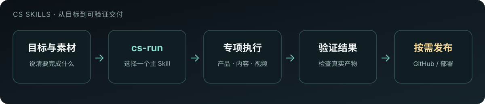

[](README.md)
[](README.en.md)
[](https://x.com/ChenshuoAI)

# CS Skills

**把真实项目里的方法做成 Agent Skills**：一句话说目标，选对工作流，完成任务，再检查交付结果。面向 Codex 和 Claude Code，也能按需用于支持 `SKILL.md` 的 Agent。

仓库现有 **16 个任务 Skill**。它们可以独立安装；不知道用哪个时，先从 [`cs-run`](cs-run/) 进入。

**快速导航：** [30 秒开始](#30-秒开始) · [选择 Skill](#选择-skill) · [README 优化视频](#实际演示用-cs-skills-优化-readme) · [完整安装说明](#安装)

## 30 秒开始

```bash
git clone https://github.com/ChenShuo2004/cs-skills.git
cd cs-skills
./scripts/install.sh --codex  # Claude Code 用 --claude
```

安装后，在新会话里直接说：

```text
$cs-run 我想优化这个项目的 README，让新人看懂它是什么、如何开始，并检查结果。
```

`cs-run` 会选一个主 Skill。只想装某几个 Skill、预览安装或卸载，请看[完整安装说明](#安装)。

## 选择 Skill

整套工作流长这样——**`cs-run` 只选一个主 Skill，交付步骤按任务需要追加**：



| Skill | 做什么 |
| --- | --- |
| [**cs-run**](cs-run/) | 把模糊目标整理成 Goal Card，读取项目上下文，选择一个主 Skill，并在用户要求执行时继续做下去。 |
| [**cs-search-skill**](cs-search-skill/) | 对产品、公司、技术、市场或竞品做深度调研；区分事实和判断，交付带来源、风险与行动建议的简报。 |
| [**cs-writer**](cs-writer/) | 把真实项目材料写成文章、产品故事、工具体验或改稿；保留事实细节，给出能直接使用的内容。 |
| [**cs-xiaohuang-skill**](cs-xiaohuang-skill/) | 保持“小黄”品牌角色身份一致，制作标准图、动作、2D/3D 变体和中文内容配图；[看实际示例](cs-xiaohuang-skill/README.md)。 |
| [**cs-auto-videl**](cs-auto-videl/) | 处理电商短视频对标与生成：拆强 Hook、规划九宫格、首帧和 Seedance／Flow／Veo 提示词包。 |
| [**cs-chatcut**](cs-chatcut/) | 从内容想法选出一个可拍主题，交付中文口播稿、素材清单、Motion Graphics、声音方向和逐镜头表。 |
| [**cs-web-promo-film**](cs-web-promo-film/) | 采集真实网页，用 Remotion 做推进、滚动和点击，渲染 30–60 秒产品演示 MP4。 |
| [**cs-knowledge-film**](cs-knowledge-film/) | 把知识点做成暗夜星空风解说片：口播稿、场景 spec、配音、双语字幕和 MP4。 |
| [**cs-code-video**](cs-code-video/) | 用代码做动画视频：先问 5 项输入、出风格卡和分镜表，确认 3 张关键帧后逐帧渲染 MP4；配乐音效代码合成，可接 GPT 出图和配音。 |
| [**cs-pixel-explainer**](cs-pixel-explainer/) | 把中文文案做成像素风 + 坐标系隐喻 + 打字机字幕的解说视频，edge-tts 配音，渲染 1080p MP4。 |
| [**cs-frontend-design**](cs-frontend-design/) | 设计、实现或评审网页与工具界面，处理布局、交互状态、响应式和浏览器验证。 |
| [**cs-clean-code**](cs-clean-code/) | 对照需求整理实现，收束业务逻辑、代码、文档和验证，留下可维护的交接状态。 |
| [**cs-ralph-runner**](cs-ralph-runner/) | 把 Markdown 需求文档转成 Ralph PRD，在本地仓库安全预演 Ralph／Codex 构建流程。 |
| [**cs-checkpoint-version**](cs-checkpoint-version/) | 在大改前保存包含未提交改动的可恢复检查点，并验证回退位置。 |
| [**cs-github-push**](cs-github-push/) | 精确提交并推送完成的改动，按需创建 PR，核对远端 SHA，区分本地提交与真正发布。 |
| [**cs-ending-time**](cs-ending-time/) | 收尾需要部署的 Web／App 功能：完成验证、GitHub 交付和上线检查。 |

`cs-recover-skill` 是模型执行校准辅助项，不计入上述 16 个任务 Skill，也不参与默认安装。

## 实际演示：用 CS Skills 优化 README

README 是读者进入仓库的第一条路径。这里用真实的 [CS Skills 首页改版提交](https://github.com/ChenShuo2004/cs-skills/commit/0b27495ba82a9297eb4028ee443edb69b7a0ef31) 做案例：`$cs-clean-code` 先核对 `AGENTS.md`、Skill 目录和安装脚本，再按“定位 → 工作流 → 技能地图 → 案例 → 安装”的顺序整理中英文 README，最后检查链接和示例。需要发布时，再交给 `$cs-github-push`。

<a href="https://cdn.jsdelivr.net/gh/ChenShuo2004/cs-skills@4627972/assets/demos/readme-optimization/demo-v2.mp4"></a>

**[观看 73 秒代码渲染教程（Fish Audio 中文配音）](https://cdn.jsdelivr.net/gh/ChenShuo2004/cs-skills@4627972/assets/demos/readme-optimization/demo-v2.mp4)** · [下载仓库中的 MP4](https://github.com/ChenShuo2004/cs-skills/raw/refs/heads/main/assets/demos/readme-optimization/demo-v2.mp4) · [口播、分镜与复现说明](assets/demos/readme-optimization/VO.md)

可以直接复制这句：

```text
$cs-clean-code 优化这个仓库的 README。先核对 AGENTS.md、各 Skill 的实际功能与安装脚本；按新读者的阅读路径重排结构，加入真实案例和可复制命令，同步英文版，最后检查相对链接和示例。
```

## 实际演示：把改动真正推到 GitHub

[`cs-github-push`](cs-github-push/SKILL.md) 负责一次明确的仓库交付：确认要发布的文件，完成相关检查，精确提交，检查远端变化后推送，最后比对本地与远端的提交 SHA。**本地 commit 不等于已经推送；推送也不等于网站上线。**

<a href="assets/demos/cs-github-push-demo.mp4"></a>

**[观看 45 秒录屏讲解（MP4）](assets/demos/cs-github-push-demo.mp4)** · [查看口播与分镜](assets/demos/cs-github-push-script.md) · [阅读完整 Skill](cs-github-push/SKILL.md)

在 Codex 或 Claude Code 中，可以直接说：

```text
$cs-github-push 把这次已完成的改动推送到 cs-skills 的 GitHub 仓库。先检查改动范围并运行相关验证，只提交本次文件；推送后比对本地和远端 SHA，告诉我分支、提交号与核验结果。
```

工作流会依次核对 `git status` 与远端、检查文件和验证结果、暂存指定路径、确认远端没有新的冲突提交，再推送并核验。需要 PR 时在请求里写明；需要部署网站或应用时使用 [`cs-ending-time`](cs-ending-time/)。视频录的是公开仓库与首次加入该 Skill 的提交详情；步骤讲解配有中文口播与字幕。

## 看一个实际产物

例如，把一篇中文文章变成“小黄”轻手绘正文配图：先用 [`cs-writer`](cs-writer/) 整理文章，再让 [`cs-xiaohuang-skill`](cs-xiaohuang-skill/) 找出认知锚点、生成 shot list 和插画。

```text
$cs-writer 把这次产品开发记录写成一篇有真实细节、可复制步骤的文章。
$cs-xiaohuang-skill 找出 4 个适合配图的认知锚点，先给我 shot list，再逐张生成。
```

下面是仓库已有的正文配图示例。完整的角色标准、动作和配图示例见 [小黄 Skill 展示页](cs-xiaohuang-skill/README.md)。


做产品原型可以直接说：

```text
$cs-run 我想做一个帮助创作者管理 AI 工作流的工具。先做最小可用原型，并告诉我如何验收。
```

## 安装

克隆仓库，用脚本把 Skill 软链接到 Codex 或 Claude Code 的技能目录：

```bash
git clone https://github.com/ChenShuo2004/cs-skills.git
cd cs-skills
./scripts/install.sh --codex
```

不指定 Skill 名称时安装全部 16 个任务 Skill；也可以只装需要的：

```bash
./scripts/install.sh --claude cs-run cs-writer  # 只装到 Claude Code
./scripts/install.sh --both cs-run               # 同时装到 Codex 和 Claude Code
./scripts/install.sh --codex --dry-run           # 预览，不修改文件
./scripts/install.sh --codex --uninstall cs-run  # 移除指向本仓库的链接
```

脚本**不会覆盖**已有目录或来自其他位置的链接，遇到冲突会报告路径。软链接依赖克隆目录的位置；保留该目录，日后 `git pull` 后重新开始 Agent 会话即可读取更新后的 Skill。全部参数见 `./scripts/install.sh --help`。

不使用脚本时，也可以手动链接某一个 Skill：

```bash
mkdir -p "$HOME/.codex/skills"
ln -s "$PWD/cs-run" "$HOME/.codex/skills/cs-run"
```

Claude Code 的目标目录是 `$HOME/.claude/skills`。只安装 `cs-run` 不会自动安装下游 Skill；要执行某个专项工作流，请同时安装对应目录。

## 前置条件

| | 必需？ | 说明 |
| --- | --- | --- |
| **Agent** | 必需 | Codex、Claude Code，或能读取 `SKILL.md` 的 Agent。 |
| **Git + Bash** | 只在克隆和使用安装脚本时需要 | 安装脚本在 macOS 的 Bash 环境完成自测；Skill 本身的运行条件看各自说明。 |
| **额外服务或渲染环境** | 按 Skill 而定 | 视频、图像和部署任务可能需要对应工具或账号；每个 `SKILL.md` 写明具体要求。 |
| **GitHub 写权限** | 仅发布时需要 | `cs-github-push` 与 `cs-ending-time` 推送目标仓库时需要。 |

## 仓库约定

每个 Skill 一个目录，入口是 `SKILL.md`。`agents/openai.yaml` 给 Codex 提供展示信息，复杂规则、脚本和素材按需放在 Skill 内：

```text
cs-skills/
├── cs-run/
│   ├── SKILL.md
│   └── agents/openai.yaml
├── cs-<name>/
│   ├── SKILL.md
│   ├── agents/openai.yaml
│   ├── references/       按需读取的详细规则
│   ├── scripts/          可重复运行的工具
│   ├── tests/            确定性逻辑的检查
│   └── assets/           示例与素材
├── scripts/              仓库级安装与自测
└── docs/                 技能清单与规划
```

新增或调整任务 Skill 时，同时核对 [`cs-run` 路由](cs-run/SKILL.md)、[技能清单](docs/skill-inventory.md)、README 和安装说明。详细规则见 [AGENTS.md](AGENTS.md)。安装脚本自测不调用模型，也不修改真实技能目录：

```bash
./scripts/test-install.sh
```

## Star 趋势

[](https://star-history.com/#ChenShuo2004/cs-skills&Date)

## License

[MIT](LICENSE) · [更新日志](CHANGELOG.md) · [贡献者](CONTRIBUTORS.md)
