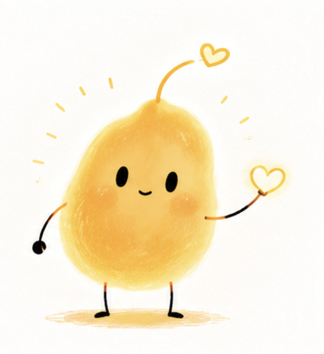
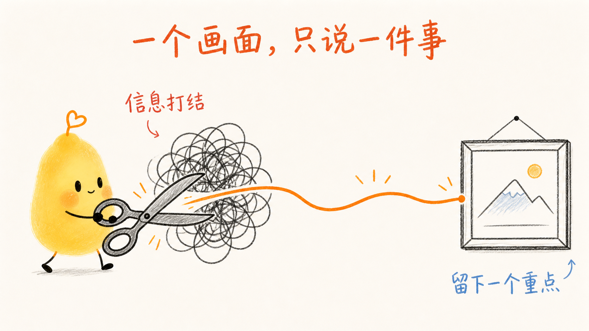
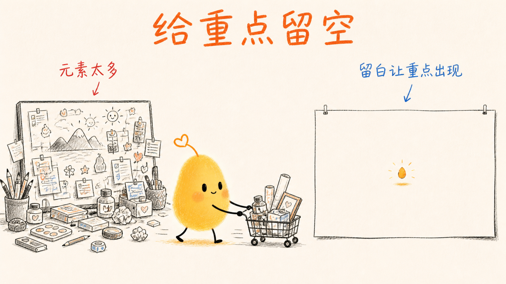
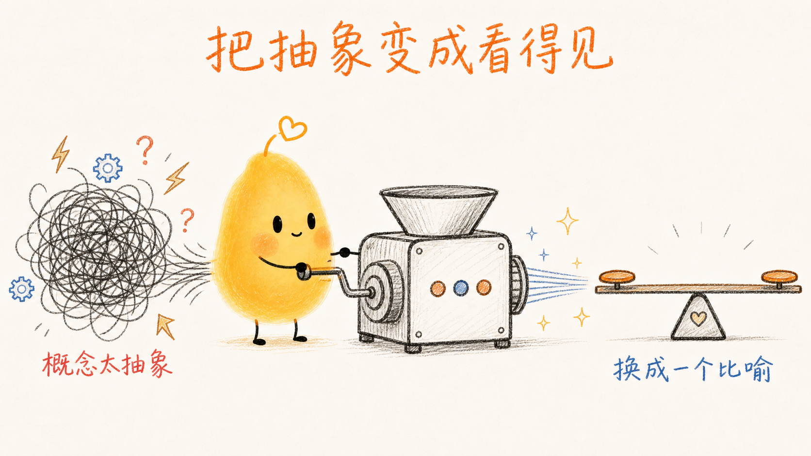
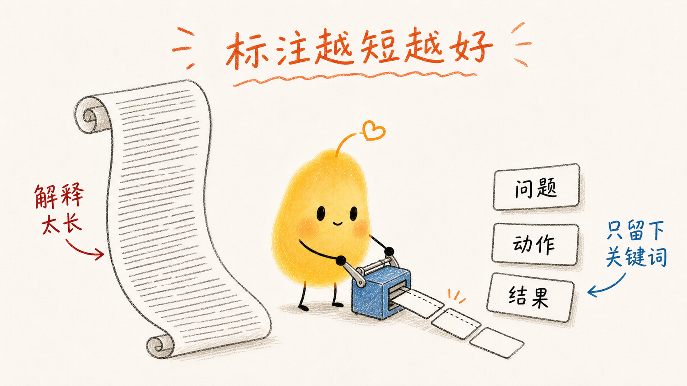
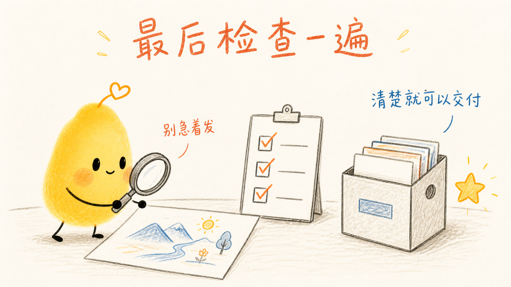

# 小黄 IP 与正文配图

> 用同一个小黄角色，稳定生成“有温度”品牌 IP 资产，或把中文内容中最重要的判断、关系和转折画成正文配图。

小黄就是“有温度”的固定品牌角色，不是通用黄色卡通形象。它有固定的暖黄色种子形身体、橙色空心爱心天线、椭圆眼睛、腮红和细手脚；无论换动作、场景、媒介或画法，都必须保持身份一致。



## 两种能力

### 品牌 IP 延展

生成、修改和延展小黄 / 有温度的标准图、动作表情、三视图、表情包、场景插画、2D/3D、黑白线稿、风格迁移、联名和身份修复。角色 DNA 始终优先于画风。

### 正文配图

`$cs-xiaohuang-skill` 先从文章里找出真正值得被理解的**认知锚点**，再把一个判断、变化、关系或隐喻变成读者一眼能看懂的画面。

它适合文章、公众号、博客、Notion 和知识型内容的正文配图；不用于复杂架构图、可编辑 SVG，或把多个观点塞进同一张图的 PPT 式信息图。

## 正文配图的固定视觉语言

- 16:9 横版、暖白底、黑色轻手绘线条和大量留白。
- 小黄必须是动作主角，不能只在角落装饰。
- 红橙色标记问题、警示或结果；蓝色标记反馈、状态或下一步。
- 每张只解释一个关系，标注要短、要可读。

品牌 IP 默认使用温和的 2D 手绘蜡笔 / 油画棒 / 彩铅质感；用户明确要求时，可转换为 3D 软胶、树脂、黑白线稿或其他媒介，但爱心天线和角色 DNA 不变。

## 七张示例流程

以下示例用于校准小黄的身份、构图和标注方式；每次创作都应根据当前内容重新设计隐喻。

### 1. 抓住一个核心动作

从信息堆里先照亮读者最该理解的那一步。


### 2. 一个画面，只说一件事

剪开打结的信息，只留下一个重点。



### 3. 把关系画出来

把分散的素材连接起来，让结论自然显现。


### 4. 给重点留空

删去干扰元素，让真正的重点出现。



### 5. 把抽象变成看得见

把难懂的概念换成直观的物理隐喻。



### 6. 标注越短越好

用少量关键词帮助理解，不用长文替代画面。



### 7. 最后检查一遍

确认画面清楚、标注可读、小黄身份正确后再交付。



## 品牌 IP 延展示例

同一角色可以有不同动作、场景和媒介，但不能变成另一只吉祥物。


## 快速调用

先只做配图规划：

```text
$cs-xiaohuang-skill 先不要生图。请找出这篇文章最值得配图的 4 个位置，输出 shot list：每张写清插入位置、核心意思、小黄动作、构图和中文标注词。
```

直接生成：

```text
$cs-xiaohuang-skill 把下面这篇文章生成 4 张小黄正文配图。每张只讲一个判断，16:9 横版、白底黑线、保留小黄爱心天线和暖黄种子形身体，配简短中文手写标注；先给 shot list，再逐张生成。
```

品牌 IP 延展：

```text
$cs-xiaohuang-skill 基于小黄身份参考图，生成一张保持暖黄种子轮廓、空心爱心天线和细黑四肢的 3D 软胶角色图；只转换材质和体积，不重新设计角色。
```

## 使用原则

正文配图让图解释文字中最难理解的那一步，而不是机械地给每一段补一张图。品牌 IP 延展则让小黄通过连接、递出、点亮或陪伴完成有意义的动作，而不是静止卖萌。
